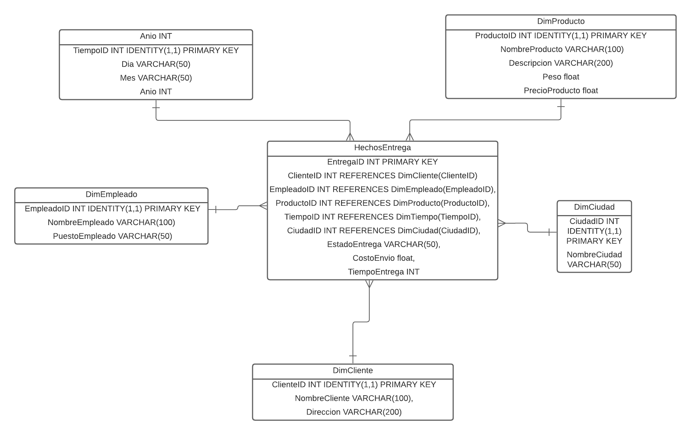

# SS2-Practica1_201404319
## Modelo de Datos Estrella para el Sistema de Entregas de USAC Delivery en Guatemala

## Descripcion de tablas de hechos y tablas de dimensiones
**Tabla de Hechos:**
La tabla de hechos es el núcleo de un modelo de datos estrella. Esta tabla almacena las métricas o medidas numéricas que deseas analizar en relación con diferentes atributos o dimensiones. En el sistema de USAC Delivery, la tabla de hechos contiene información sobre cada entrega individual, como el costo de envío, el tiempo de entrega, el estado de la entrega, etc.

La tabla de hechos "HechosEntregas" se ve de la siguiente manera:
- **EntregaID:** Un identificador único para cada entrega.
- **ClienteID:** Un identificador que hace referencia a la tabla de dimensión "DimCliente", para relacionar la entrega con el cliente.
- **EmpleadoID:** Un identificador que hace referencia a la tabla de dimensión "DimEmpleado", para relacionar la entrega con el empleado que realizó la entrega.
- **ProductoID:** Un identificador que hace referencia a la tabla de dimensión "DimProducto", para relacionar la entrega con el producto entregado.
- **TiempoID:** Un identificador que hace referencia a la tabla de dimensión "DimTiempo", para relacionar la entrega con la fecha y el tiempo de entrega.
- **CiudadID:** Un identificador que hace referencia a la tabla de dimensión "DimCiudad", para relacionar la entrega con la ciudad de entrega.
- **EstadoEntrega:** El estado actual de la entrega (entregado, en tránsito, etc.).
- **CostoEnvio:** El costo de envío asociado a la entrega.
- **CostoTotal:** El costo total de la entrega (incluyendo el costo de envío y el precio del producto).
- **TiempoEntrega:** El tiempo de entrega en minutos.

**Tablas de Dimensiones:**
Las tablas de dimensiones contienen atributos descriptivos que se utilizan para organizar y categorizar los datos en la tabla de hechos. Estas tablas enriquecen la información de la tabla de hechos al proporcionar contextos adicionales para las métricas almacenadas. Las tablas de dimensiones podrían ser las siguientes:
- **DimCliente:** Almacena información sobre los clientes, como su nombre, dirección y ciudad.
- **DimEmpleado:** Contiene detalles sobre los empleados, como su nombre y puesto.
- **DimProducto:** Almacena detalles sobre los productos, como su nombre, descripción, peso y precio.
- **DimTiempo:** Almacena información sobre la fecha y el tiempo de entrega.
- **DimCiudad:** Contiene detalles sobre las ciudades de entrega.
